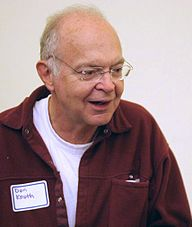

<table class="infobox biography vcard">
<tbody>
<tr>
<td colspan="2">

Knuth in 2005

</td>
</tr>
<tr>
<th scope="row">Born</th>
<td>

Donald Ervin Knuth

 January 10, 1938&nbsp;(age&nbsp;82) 

<a title="Milwaukee" href="https://en.wikipedia.org/wiki/Milwaukee">Milwaukee, Wisconsin</a>, U.S.

</td>
</tr>
<tr>
<th scope="row">Nationality</th>
<td class="category">American</td>
</tr>
<tr>
<th scope="row">Alma&nbsp;mater</th>
<td>

<ul>
<li><a title="Case Western Reserve University" href="https://en.wikipedia.org/wiki/Case_Western_Reserve_University">Case Institute of Technology</a>&nbsp;(B.S., M.S.)</li>
<li><a title="California Institute of Technology" href="https://en.wikipedia.org/wiki/California_Institute_of_Technology">California Institute of Technology</a>&nbsp;(Ph.D.)</li>
</ul>

</td>
</tr>
<tr>
<th scope="row">Known&nbsp;for</th>
<td>

<ul>
<li><em><a title="The Art of Computer Programming" href="https://en.wikipedia.org/wiki/The_Art_of_Computer_Programming">The Art of Computer Programming</a></em></li>
<li><a title="TeX" href="https://en.wikipedia.org/wiki/TeX">TeX</a>,&nbsp;<a class="mw-redirect" title="METAFONT" href="https://en.wikipedia.org/wiki/METAFONT">METAFONT</a>,&nbsp;<a title="Computer Modern" href="https://en.wikipedia.org/wiki/Computer_Modern">Computer Modern</a></li>
<li><a title="Knuth's up-arrow notation" href="https://en.wikipedia.org/wiki/Knuth%27s_up-arrow_notation">Knuth's up-arrow notation</a></li>
<li><a title="Knuth&ndash;Morris&ndash;Pratt algorithm" href="https://en.wikipedia.org/wiki/Knuth%E2%80%93Morris%E2%80%93Pratt_algorithm">Knuth&ndash;Morris&ndash;Pratt algorithm</a></li>
<li><a title="Knuth&ndash;Bendix completion algorithm" href="https://en.wikipedia.org/wiki/Knuth%E2%80%93Bendix_completion_algorithm">Knuth&ndash;Bendix completion algorithm</a></li>
<li><a title="MMIX" href="https://en.wikipedia.org/wiki/MMIX">MMIX</a></li>
<li><a title="Robinson&ndash;Schensted&ndash;Knuth correspondence" href="https://en.wikipedia.org/wiki/Robinson%E2%80%93Schensted%E2%80%93Knuth_correspondence">Robinson&ndash;Schensted&ndash;Knuth correspondence</a></li>
<li><a title="LR parser" href="https://en.wikipedia.org/wiki/LR_parser">LR parser</a></li>
<li><a title="Literate programming" href="https://en.wikipedia.org/wiki/Literate_programming">Literate programming</a></li>
</ul>

</td>
</tr>
<tr>
<th scope="row">Spouse(s)</th>
<td>Nancy Jill Carter</td>
</tr>
<tr>
<th scope="row">Children</th>
<td>2</td>
</tr>
<tr>
<th scope="row">Awards</th>
<td>

<ul>
<li><a class="mw-redirect" title="Outstanding Contribution to Computer Science Education" href="https://en.wikipedia.org/wiki/Outstanding_Contribution_to_Computer_Science_Education">SIGCSE Outstanding Contribution</a>&nbsp;(1986)</li>
<li><a title="Grace Murray Hopper Award" href="https://en.wikipedia.org/wiki/Grace_Murray_Hopper_Award">Grace Murray Hopper Award</a>&nbsp;(1971)</li>
<li><a title="Turing Award" href="https://en.wikipedia.org/wiki/Turing_Award">Turing Award</a>&nbsp;(1974)</li>
<li><a title="Member of the National Academy of Sciences" href="https://en.wikipedia.org/wiki/Member_of_the_National_Academy_of_Sciences">Member of the National Academy of Sciences</a>&nbsp;(1975)</li>
<li><a title="National Medal of Science" href="https://en.wikipedia.org/wiki/National_Medal_of_Science">National Medal of Science</a>&nbsp;(1979)</li>
<li><a class="mw-redirect" title="John von Neumann Medal" href="https://en.wikipedia.org/wiki/John_von_Neumann_Medal">John von Neumann Medal</a>&nbsp;(1995)</li>
<li><a title="Harvey Prize" href="https://en.wikipedia.org/wiki/Harvey_Prize">Harvey Prize</a>&nbsp;(1995)</li>
<li><a title="Kyoto Prize" href="https://en.wikipedia.org/wiki/Kyoto_Prize">Kyoto Prize</a>&nbsp;(1996)</li>
<li><a class="mw-redirect" title="Foreign Member of the Royal Society" href="https://en.wikipedia.org/wiki/Foreign_Member_of_the_Royal_Society">Foreign Member of the Royal Society</a>&nbsp;(2003)</li>
<li><a class="mw-redirect" title="Faraday Medal" href="https://en.wikipedia.org/wiki/Faraday_Medal">Faraday Medal</a>&nbsp;(2011)</li>
<li><a class="mw-redirect" title="BBVA Foundation Frontiers of Knowledge Award" href="https://en.wikipedia.org/wiki/BBVA_Foundation_Frontiers_of_Knowledge_Award">BBVA Foundation Frontiers of Knowledge Award</a>&nbsp;(2010)</li>
<li><a class="mw-redirect" title="Turing Lecture" href="https://en.wikipedia.org/wiki/Turing_Lecture">Turing Lecture</a>&nbsp;(2011)</li>
</ul>

</td>
</tr>
<tr>
<td colspan="2"><strong>Scientific career</strong></td>
</tr>
<tr>
<th scope="row">Fields</th>
<td class="category">

<ul>
<li><a title="Mathematics" href="https://en.wikipedia.org/wiki/Mathematics">Mathematics</a></li>
<li><a title="Computer science" href="https://en.wikipedia.org/wiki/Computer_science">Computer science</a></li>
</ul>

</td>
</tr>
<tr>
<th scope="row">Institutions</th>
<td><a title="Stanford University" href="https://en.wikipedia.org/wiki/Stanford_University">Stanford University</a></td>
</tr>
<tr>
<th scope="row"><a title="Thesis" href="https://en.wikipedia.org/wiki/Thesis">Thesis</a></th>
<td><a class="external text" href="1.pdf" rel="nofollow"><em>Finite Semifields and Projective Planes</em></a>&nbsp;(1963)</td>
</tr>
<tr>
<th scope="row"><a title="Doctoral advisor" href="https://en.wikipedia.org/wiki/Doctoral_advisor">Doctoral advisor</a></th>
<td><a title="Marshall Hall (mathematician)" href="https://en.wikipedia.org/wiki/Marshall_Hall_(mathematician)">Marshall Hall, Jr.</a></td>
</tr>
<tr>
<th scope="row">Doctoral students</th>
<td>

<ul>
<li><a title="Leonidas J. Guibas" href="https://en.wikipedia.org/wiki/Leonidas_J._Guibas">Leonidas J. Guibas</a></li>
<li><a title="Michael Fredman" href="https://en.wikipedia.org/wiki/Michael_Fredman">Michael Fredman</a></li>
<li><a title="Scott Kim" href="https://en.wikipedia.org/wiki/Scott_Kim">Scott Kim</a></li>
<li><a title="Vaughan Pratt" href="https://en.wikipedia.org/wiki/Vaughan_Pratt">Vaughan Pratt</a></li>
<li><a title="Robert Sedgewick (computer scientist)" href="https://en.wikipedia.org/wiki/Robert_Sedgewick_(computer_scientist)">Robert Sedgewick</a></li>
<li><a title="Jeffrey Vitter" href="https://en.wikipedia.org/wiki/Jeffrey_Vitter">Jeffrey Vitter</a></li>
<li><a title="Andrei Broder" href="https://en.wikipedia.org/wiki/Andrei_Broder">Andrei Broder</a></li>
</ul>

</td>
</tr>
<tr>
<th scope="row">Website</th>
<td><a class="external text" href="https://cs.stanford.edu/~knuth" rel="nofollow">cs<wbr />.stanford<wbr />.edu<wbr />/~knuth</a></td>
</tr>
</tbody>
</table>

<ul>
 <li><a target="_blank" href="https://github.com/manjunath5496/The-Art-of-Computer-Programming-Books/blob/master/aoc(1).pdf" style="text-decoration:none;">The Art of Computer Programming, Volume 4A: Combinatorial Algorithms, Part 1</a></li>
  
<li><a target="_blank" href="https://github.com/manjunath5496/The-Art-of-Computer-Programming-Books/blob/master/aoc(2).pdf" style="text-decoration:none;">The Art of Computer Programming, Fascicle 1: MMIX </a></li>  
  
<li><a target="_blank" href="https://github.com/manjunath5496/The-Art-of-Computer-Programming-Books/blob/master/aoc(3).pdf" style="text-decoration:none;">The Art of Computer Programming, Pre-Fascicle 2A</a></li>

 
<li><a target="_blank" href="https://github.com/manjunath5496/The-Art-of-Computer-Programming-Books/blob/master/aoc(4).pdf" style="text-decoration:none;">THE MMIX SUPPLEMENT: Supplement to The Art of Computer Programming Volumes 1, 2, 3</a></li>
                               
  <li><a target="_blank" href="https://github.com/manjunath5496/The-Art-of-Computer-Programming-Books/blob/master/aoc(5).pdf" style="text-decoration:none;">The Art of Computer Programming: Volume 1: Fundamental Algorithms  </a></li>   

 <li><a target="_blank" href="https://github.com/manjunath5496/The-Art-of-Computer-Programming-Books/blob/master/aoc(6).pdf" style="text-decoration:none;">The Art of Computer Programming, Volume 2: Seminumerical Algorithms</a></li>
                <li><a target="_blank" href="https://github.com/manjunath5496/The-Art-of-Computer-Programming-Books/blob/master/aoc(7).pdf" style="text-decoration:none;">The Art of Computer Programming: Volume 3: Sorting and Searching</a></li>  
         
</ul>
